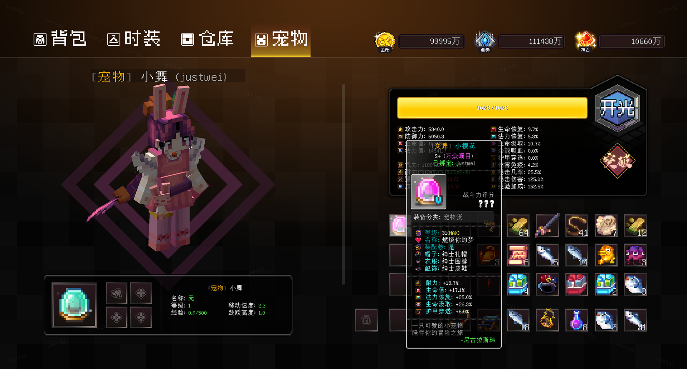

# JustAttribute

> 角色属性系统





#### API
```yaml
`JustAttributeAPI`

# 获取玩家角色对象
getRoleCharacter(Player player);
getRoleCharacter(UUID uuid);
```

#### Event
```yaml
# 角色账户加载完成事件
RoleAccountLoadedEvent
# 角色属性更新事件
RoleAttributeUpdateEvent
# 角色状态更新事件
RoleStateUpdateEvent
# 角色法力值消耗事件
RoleConsumeManaEvent
# 角色物理伤害事件
RoleLaunchAttackEvent
# 角色技能伤害事件
RoleSkillAttackEvent
# 角色吸血事件
RoleVampireEvent
# 角色遭受攻击事件
RoleUnderAttackEvent
# 角色濒死事件
RoleNearDeathEvent

# 装备强化事件
SmithyEnhanceEvent
# 装备鉴定事件
SmithyIdentifyEvent
# 装备封印事件
SmithySealEvent
# 装备属性继承事件
SmithyTransferEvent

# 装备绑定事件
EquipBoundEvent
# 物品过期事件
ItemExpiredEvent
```

#### 命令
```yaml
  /attribute
```

#### 占位符
```yaml
%attribute_<identifier>%
```

#### 品质
> node: justattribute.quality

| ID  | 显示名 |    描述     |
|:----|:---:|:---------:|
| 0   |  C  | 一无是处 (普通) |
| 1   |  B  | 十分常见 (优良) |
| 2   | B+  | 不可多得 (精致) |
| 3   |  A  | 百里挑一 (完美) |
| 4   | A+  | 千载难逢 (史诗) |
| 5   |  S  |   希世之珍    |
| 6   | S+  |   万众瞩目    |
| 7   | SS  |   王者无敌    |
| 8   | SSS |   超凡入圣    |

#### 类型
> node: justattribute.classify

| ID  |   显示名    |
|:----|:--------:|
| 0   |    武器    |
| 1   |    副手    |
| 2   |    防具    |
| 3   |    眼镜    |
| 4   |    耳坠    |
| 5   |    手套    |
| 6   |    戒指    |
| 7   |    勋章    |
| 8   |    头衔    |
| 9   |    药水    |
| 21  |   宠物蛋    |
| 22  |   宠物鞍    |
| 23  | 宠物装备(帽子) |
| 24  | 宠物装备(衣服) |
| 25  | 宠物装备(装饰) |
| 100 |  时装(套装)  |
| 101 | 时装(主武器)  |
| 102 | 时装(副武器)  |
| 103 |  时装(头饰)  |
| 104 |  时装(上装)  |
| 105 |  时装(裤子)  |
| 106 |  时装(鞋子)  |
| 107 |  时装(翅膀)  |

#### 绑定
> node: justattribute.soulbound.action

| ID  |     描述      |
|:----|:-----------:|
| 0   | 自动绑定(不可封印)  |
| 1   | 使用后绑定(不可封印) |
| 2   | 道具绑定(不可封印)  |
| 10  |    自动绑定     |
| 11  |    使用后绑定    |
| 12  |    道具绑定     |

#### 潜能评级
> node: justattribute.potency.grade

| ID  | 符号  |  名称  |
|:----|:---:|:----:|
| -1  |  ㅐ  | None |
| 0   |  ㅑ  |  B   |
| 1   |  ㅒ  |  A   |
| 2   |  ㅓ  |  S   |
| 3   |  ㅔ  |  SS  |
| 4   |  ㅏ  | SSS  |